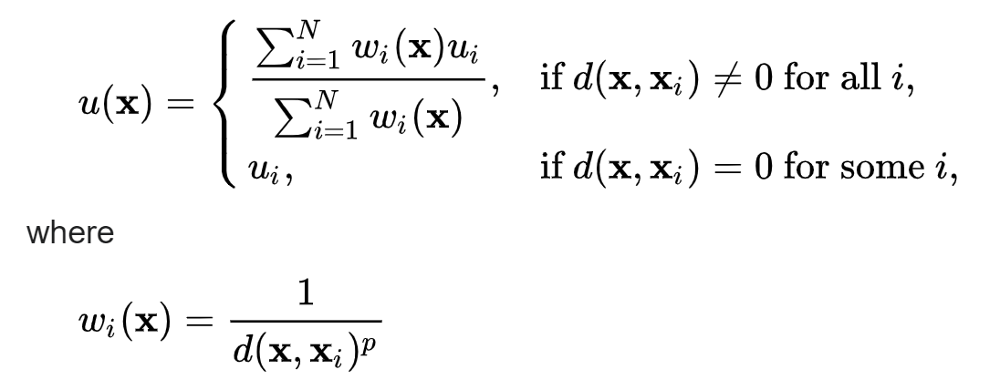
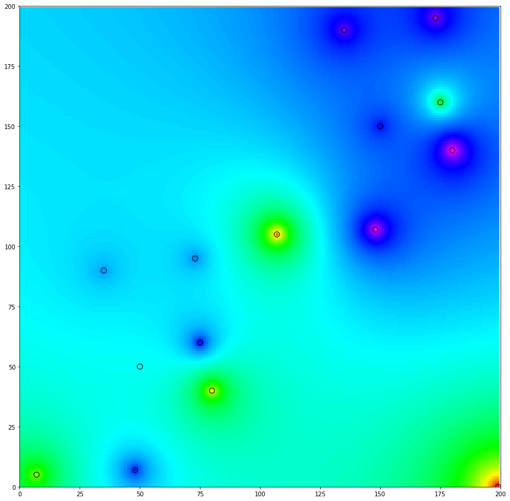
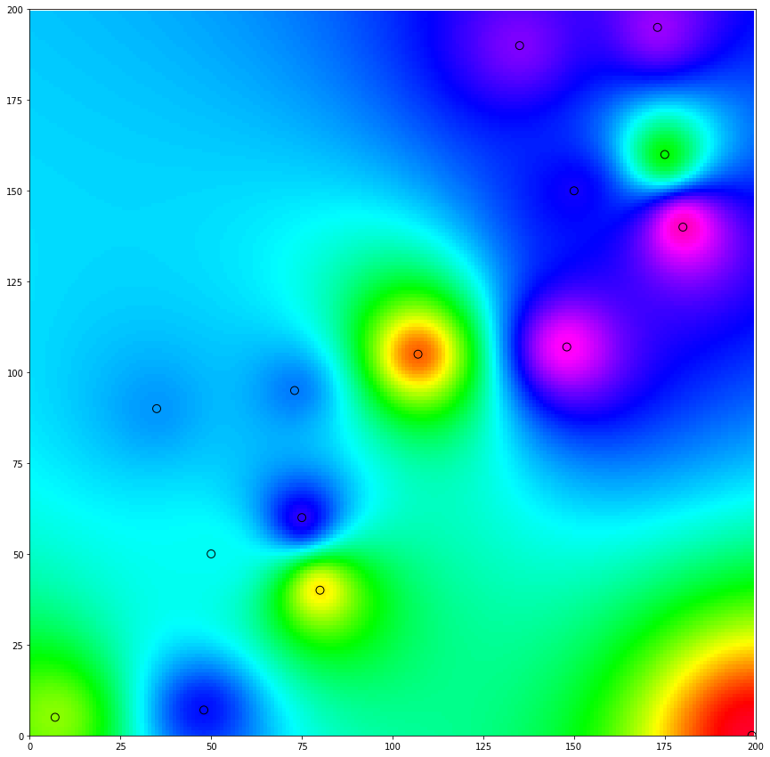
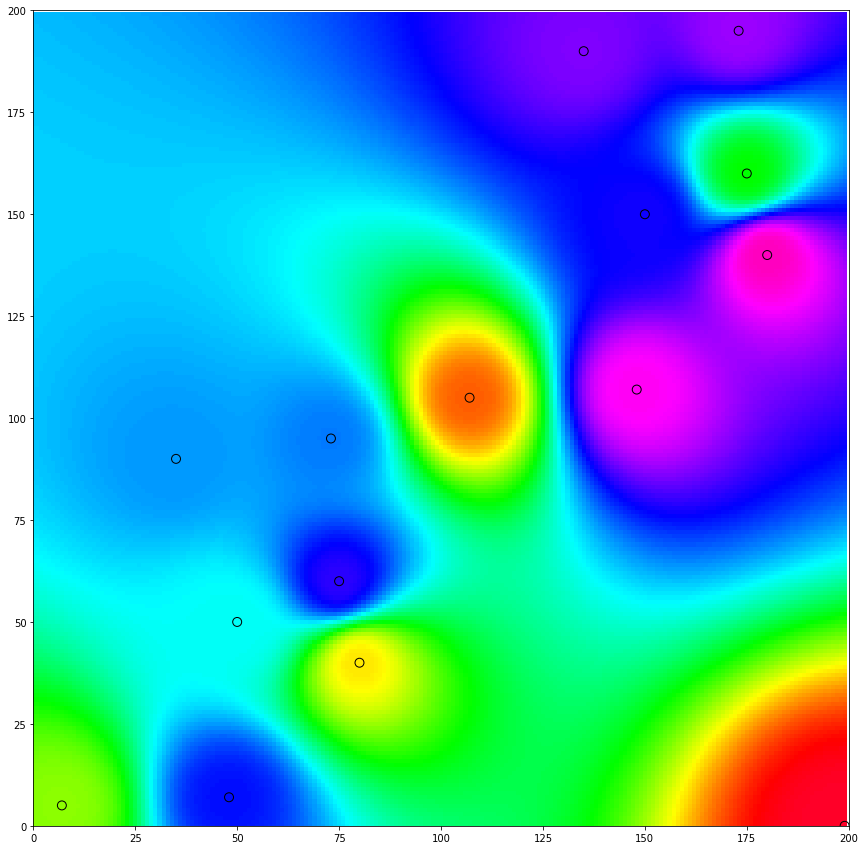
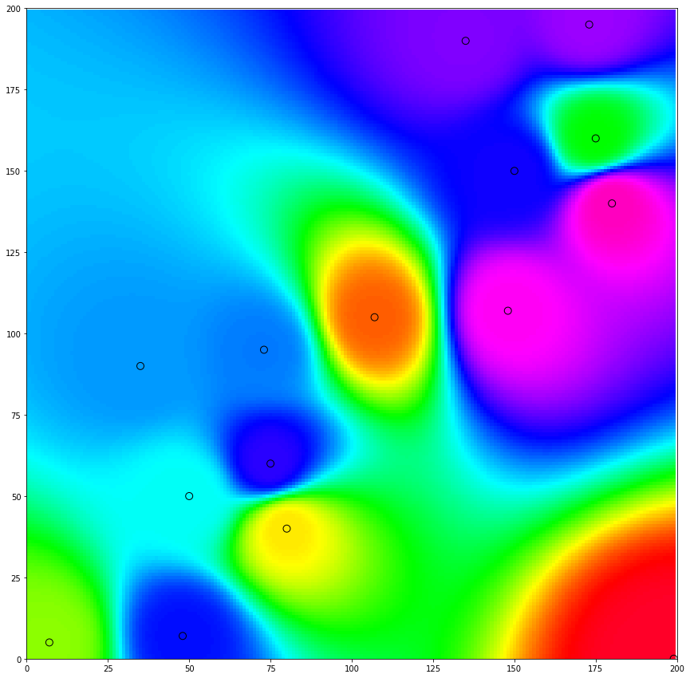

# Inverse Distance Weighted Algorithm
Inverse distance weighting is a type of deterministic method for multivariate interpolation with a known scattered set of points. The assigned values to unknown points are calculated with a weighted average of the values available at the known points. 

## What is interpolation?
> Interpolation is a type of estimation, a method of constructing new data points within the range of a discrete set of known data points. 

## Why we need interpolation?
> Visiting every location in a study area to measure the height, magnitude, or concentration of a phenomenon is usually difficult or expensive. Instead, dispersed sample input point locations can be selected and a predicted value can be assigned to all other locations. Input points can be either randomly, strategically, or regularly spaced points containing height, concentration, or magnitude measurements.

## Formula?

> Here, `d` is distance between the points and `p` is the power.
## Power = 1

## Power = 2

## Power = 3

## Power = 4

